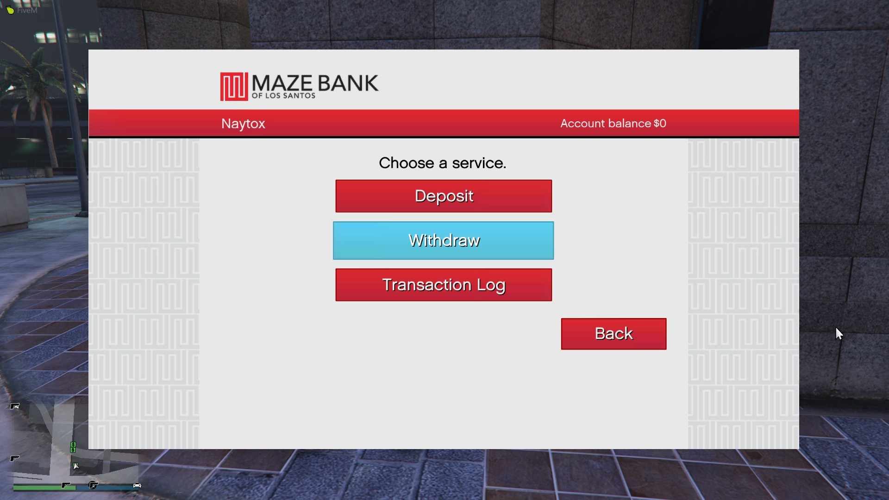
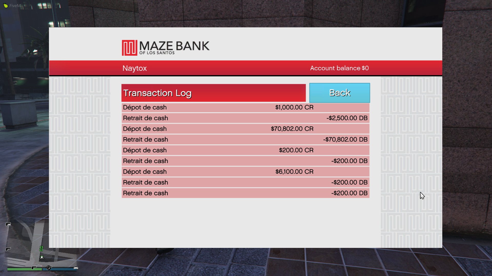

# ATM:UI

Hello everyone, I am releasing an updated and ATM UI like GTA:O using scaleform, working for ESX but easily configurablez

Features:
* Easily configurable
* Works perfectly with OneSync & OneSync Infinity
* Open Control configurable in the Settings
* The UI is translated with the language of the game
* Transaction Logs saved client-side
* Transaction log easily added with an event

Pictures :
* Main Menu : 

* Transaction Log Menu : 

Notes:
* It is compatible with ESX 1.1.0 but very easily updatable
* All the ATM are present

How to install:
1. Download the repo here [ATM:UI](https://github.com/Naytoxp/atm_ui)
2. Place the resource in your resource folder
3. Configure in [s_main.lua] the money functions/events
4. Add "start atm_ui" to your server.cfg
5. Enjoy

Credits:
* Thanks a lot to **teb - https://lsrp.cz**, for helping me with the scaleform stuff
